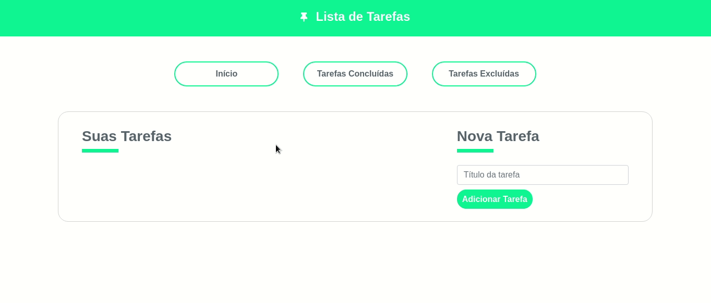

# **Lista de Tarefas**
<h1>
    
</h1>

## :pencil: **Sobre**
Este projeto foi desenvolvido com o objetivo de aplicar meus conhecimentos com o framework VueJS. <br>
O projeto consiste em um painel com as tarefas listadas, cadastro de novas tarefas e dois botões: um para marcar a tarefa como concluída e outro para excluir a tarefa. Além disso o usuário pode ter acesso a uma lista com as tarefas concluídas e excluídas.

## :computer: **Tecnologias Utilizadas**
- HTML5
- CSS3
- Bootstrap4
- VueJS


## :arrow_down: **Como Baixar**
```
$ yarn install

$ yarn serve

$ yarn build

$ yarn lint